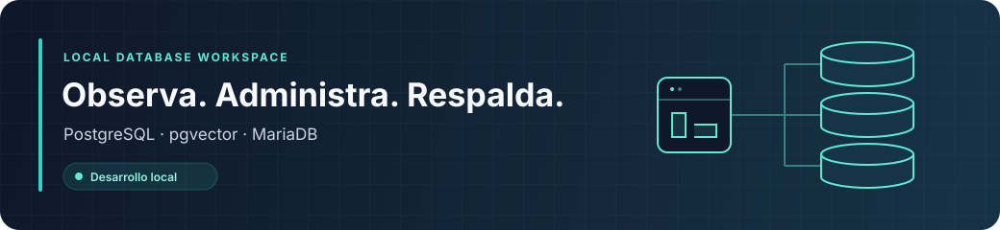

<a id="cluster-sql"></a>
<h1 align="center">cluster-sql</h1>



<p align="center">
  <strong>Guía técnica · Dashboard y stack SQL para desarrollo local</strong><br>
  Docker Compose · Node.js 24 · pnpm 12.8.1 · React · Fastify
</p>

Monorepo para administrar un stack local de PostgreSQL, PostgreSQL con pgvector y MariaDB. Incluye pgAdmin, phpMyAdmin, backups y un dashboard web. El dashboard se ejecuta en el host y controla Docker mediante su CLI.

**Ir a:** [Inicio rápido](#inicio-rápido) · [Servicios](#servicios-y-conexiones) · [Backups](#backups) · [Configuración](#configuración-del-dashboard) · [Diagnóstico](#diagnóstico) · [Mapa del proyecto](#mapa-del-repositorio)

---

## Qué puedes hacer

| Área | Funcionalidad disponible |
| --- | --- |
| **Observación** | Estado, salud, detalle del healthcheck y puertos publicados de los seis servicios. |
| **Logs** | Streaming con pausa y reconexión; últimas 200 líneas al conectar y hasta 5.000 en pantalla. |
| **Operaciones** | Iniciar, detener y reiniciar servicios; resultado en la actividad reciente. |
| **Gestión SQL** | Enlaces a pgAdmin y phpMyAdmin con los puertos reales. |
| **Backups** | Listado, descarga, ejecución manual y estado persistente del último ciclo automático. |
| **Coordinación** | Bloqueo compartido entre backups y acciones que afectan bases o dependencias. |

> [!NOTE]
> **Alcance local.** No incluye autenticación, acceso remoto al dashboard, métricas de CPU/RAM, restauración o eliminación desde la UI, ni administración de otros proyectos Docker.

La actividad de las acciones vive en memoria y se pierde al reiniciar la API; el resultado del backup automático permanece en disco.

## Requisitos

| Herramienta | Versión / condición | Para qué se usa |
| --- | --- | --- |
| Docker + Compose | Docker activo y Compose v2 en la terminal | Ejecutar y administrar el stack |
| Node.js | 24 · [.nvmrc](.nvmrc) | Ejecutar el dashboard |
| pnpm | 12.8.1 · [package.json](package.json) | Instalar y compilar el monorepo |
| Python | 3 | Pruebas de backups e integración Docker |

Ejecuta los comandos desde la raíz del repositorio. En Windows, usa un entorno WSL2 con acceso a Docker y ejecuta también Node/pnpm allí.

## Inicio rápido

### 1. Prepara la configuración

Si aún no existe `.env`, copia la plantilla:

```sh
cp .env.example .env
```

Edita usuarios, contraseñas, nombres de las tres bases y el correo de pgAdmin.

> [!IMPORTANT]
> Conserva tu `.env` si ya existe. Las credenciales de la plantilla son ejemplos y debes reemplazarlas.

### 2. Levanta el stack

```sh
docker compose config --quiet
docker compose up -d --wait
```

Esto inicia las tres bases y sus herramientas de gestión. Los backups periódicos se activan por separado en [Backups](#backups).

### 3. Abre el dashboard

```sh
pnpm install --frozen-lockfile
pnpm dev
```

**Abre [127.0.0.1:5173](http://127.0.0.1:5173).** Vite sirve la web en 5173 y redirige `/api` a la API en 3000. El dashboard también muestra los servicios que todavía no se han creado; iniciarlos requiere un `.env` válido.

### Ejecutar la aplicación compilada

```sh
pnpm build
pnpm start
```

**Abre [127.0.0.1:3000](http://127.0.0.1:3000).** El servidor usa los archivos compilados de `apps/web/dist`; vuelve a compilar después de cambiar el código.

| Modo | Comando | URL de la web |
| --- | --- | --- |
| Desarrollo con Vite | `pnpm dev` | [127.0.0.1:5173](http://127.0.0.1:5173) |
| Aplicación compilada | `pnpm build` y luego `pnpm start` | [127.0.0.1:3000](http://127.0.0.1:3000) |

## Servicios y conexiones

Los puertos siguientes son los valores de `.env.example`; puedes modificarlos en `.env`.

| Servicio Compose | Imagen | Acceso desde el host | Dentro de la red Compose |
| --- | --- | --- | --- |
| `postgres` | `postgres:17-trixie` | `127.0.0.1:5432` | `postgres:5432` |
| `postgres-vector` | `pgvector/pgvector:pg17-trixie` | `127.0.0.1:5433` | `postgres-vector:5432` |
| `mariadb` | `mariadb:lts-ubi9` | `127.0.0.1:3306` | `mariadb:3306` |
| `pgadmin4` | `dpage/pgadmin4:9` | [localhost:8081](http://127.0.0.1:8081) | `pgadmin4:80` |
| `phpmyadmin` | `phpmyadmin:5` | [localhost:8082](http://127.0.0.1:8082) | `phpmyadmin:80` |
| `backup` | `cluster-sql-backup:pg17` (construida localmente) | Carpeta `backups/` | Sin puerto publicado |

### Conectar las herramientas

En pgAdmin registra los servidores como `postgres:5432` y `postgres-vector:5432`, usando `POSTGRES_USER` y `POSTGRES_PASS`. Ambas instancias comparten esas credenciales, pero tienen bases y volúmenes separados. phpMyAdmin apunta a `mariadb`; ingresa con un usuario de MariaDB.

### Habilitar pgvector

La imagen pgvector incluye la extensión, pero debes habilitarla en cada base donde la necesites:

```sh
docker compose exec postgres-vector sh -c 'psql -v ON_ERROR_STOP=1 -U "$POSTGRES_USER" -d "$POSTGRES_DB" -c "CREATE EXTENSION IF NOT EXISTS vector;"'
```

### Persistencia de datos

Los datos persisten en los volúmenes `postgres_data`, `pg_vector_data`, `mariadb_data` y `pgadmin_data` del proyecto Compose `cluster-sql`. Cambiar las credenciales o nombres de bases en `.env` no modifica las bases ya inicializadas: realiza esos cambios con SQL y actualiza la configuración correspondiente.

## Backups

### Automáticos

Para activar el servicio periódico:

```sh
docker compose --profile backup up -d --build backup
```

El primer ciclo empieza al arrancar. `BACKUP_INTERVAL` define la espera entre ciclos (86.400 segundos por defecto) y `BACKUP_RETENTION_DAYS` la retención (7 por defecto). En Linux, ajusta `UID` y `GID` al propietario deseado de los archivos.

### Manuales

El botón de backup manual requiere las tres bases en ejecución y saludables. No necesita mantener activo el servicio periódico. Su equivalente por terminal es:

```sh
docker compose build backup
docker compose --profile backup run --rm --no-deps -T backup --once
```

### Qué se guarda y cómo se protege

Cada ciclo genera tres dumps SQL comprimidos en `backups/`: uno de `POSTGRES_DB`, uno de `POSTGRES_VECTOR_DB` y uno de `MARIADB_DATABASE`. No respalda otras bases, roles globales de PostgreSQL ni la configuración de pgAdmin. El backup de cada base es independiente; el ciclo no es una instantánea sincronizada de las tres.

Los archivos se escriben como `.sql.gz.part` y se publican como `.sql.gz` solo cuando el dump termina correctamente. La rotación usa `find -mtime +BACKUP_RETENTION_DAYS` y solo se ejecuta si los tres dumps tuvieron éxito; los fallos conservan las copias anteriores.

`backups/.backup.lock` impide ciclos simultáneos. Las acciones del dashboard que afectan bases o sus dependencias usan el mismo bloqueo mediante un contenedor temporal. Los comandos Docker ejecutados directamente fuera del dashboard no pasan por esa protección.

### Estado del último ciclo

El script guarda el último estado en `.backup-status-automatic.json` y `.backup-status-manual.json`. El dashboard muestra el automático: en curso, completado, fallido o interrumpido. Si todavía no existe, muestra que no hay un ciclo registrado. Las fechas del estado se guardan en UTC; los nombres de los dumps usan la zona horaria del servicio. No se guarda un historial de ciclos.

### Restauración y mantenimiento

La restauración se realiza por CLI o por las herramientas de gestión. Selecciona el archivo, la instancia y la base de destino, y valida la recuperación antes de depender de una copia. La prueba de integración incluye una restauración real de las tres bases y de datos vectoriales.

Si cambias `backup.sh`, reinicia `backup`; si cambias su Dockerfile, reconstruye y recrea el servicio:

```sh
docker compose --profile backup restart backup
# Después de cambiar docker/backup/Dockerfile:
docker compose --profile backup up -d --build backup
```

## Configuración del dashboard

> [!TIP]
> **Dos configuraciones distintas:** `.env` configura Compose. Las variables `DASHBOARD_*` se pasan al entorno del proceso Node; no se cargan automáticamente desde `.env`.

| Variable | Valor predeterminado | Uso |
| --- | --- | --- |
| `DASHBOARD_PROJECT` | `cluster-sql` | Filtrado por etiqueta de proyecto Compose |
| `DASHBOARD_COMPOSE_FILE` | `docker-compose.yml` | Archivo para ejecutar las acciones |
| `DASHBOARD_ENV_FILE` | Sin override | Archivo de variables alternativo para Compose |
| `DASHBOARD_BACKUPS_DIR` | `backups` | Carpeta que lista y sirve la API |
| `DASHBOARD_PORT` | `3000` | Puerto de la API y de la web compilada |

Las rutas relativas se resuelven desde la raíz del repositorio. El directorio de backups de la API debe corresponder al montaje `/backups` de Compose. Mantén coherentes el proyecto, el archivo Compose y sus etiquetas.

La API fija el contexto Docker al usarlo por primera vez y lo muestra en el dashboard. Si cambias de contexto, reinicia la API. Solo administra los seis nombres de servicio definidos en el proyecto; excluye contenedores temporales de `compose run`.

Para cambiar el puerto, usa la aplicación compilada, por ejemplo `DASHBOARD_PORT=3001 pnpm start`. En desarrollo, el proxy Vite apunta a 3000 y requiere modificar también `apps/web/vite.config.ts` si cambias ese puerto.

## Acceso remoto

`BIND_ADDRESS=127.0.0.1` publica las bases y sus herramientas únicamente en el host. Cambiarlo a una IP de LAN/VPN o a `0.0.0.0` amplía ese acceso. Antes de hacerlo, configura credenciales propias, `PGADMIN_SERVER_MODE=True`, `PMA_ARBITRARY=0` y las restricciones de acceso de tu entorno.

El dashboard sigue ligado a `127.0.0.1`, sin autenticación y con validación de Host/Origin local. `BIND_ADDRESS` no cambia su dirección de escucha. No está preparado para publicarse en la red.

### Zona horaria

`TZ` configura la zona horaria del stack; `POSTGRES_TZ`, `MARIADB_TZ`, `PMA_TZ`, `PGADMIN_TZ` y `BACKUP_TZ` permiten overrides por servicio.

## Desarrollo y validación

| Comando | Verificación |
| --- | --- |
| `pnpm lint` | ESLint |
| `pnpm typecheck` | Tipos de contratos, API y web |
| `pnpm test` | Pruebas de API, componentes web y script de backups |
| `pnpm build` | Compilación de los tres paquetes |
| `python3 tests/runtime_test.py` | Integración real con Docker, después de compilar |

La integración crea un proyecto temporal, puertos de bases asignados por Docker y volúmenes propios. Verifica servicios, enlaces, acciones, bloqueos, backups, descargas y restauración; elimina sus recursos al finalizar. Necesita Docker activo, imágenes disponibles y el puerto 3010 libre. Con `--keep`, conserva el entorno mientras inspeccionas la UI; termina con Ctrl+C para ejecutar la limpieza.

## Diagnóstico

| Síntoma | Qué revisar |
| --- | --- |
| **Variables ausentes** | Revisa `.env` y ejecuta `docker compose config --quiet`. |
| **Docker no responde o faltan servicios** | Comprueba `docker info`, `docker context show` y `docker compose ps -a`; reinicia la API después de cambiar de contexto. |
| **Servicio no saludable** | Consulta su detalle en el dashboard o ejecuta `docker compose logs --tail 100 NOMBRE_SERVICIO`. |
| **Puerto ocupado** | Cambia el puerto del servicio en `.env` y recréalo con `docker compose up -d NOMBRE_SERVICIO`. |
| **Acción bloqueada** | Espera a que termine el backup o la operación dependiente y revisa su resultado en actividad reciente. |
| **Credenciales nuevas no funcionan** | El volumen conserva las credenciales anteriores; cambiar `.env` no las reemplaza. |

> [!WARNING]
> `docker compose down` conserva los volúmenes. Añadir `-v` elimina los datos persistentes; no lo uses como solución rutinaria a errores.

## Mapa del repositorio

```text
.
├── apps/
│   ├── api/             # Fastify · Docker CLI · logs y backups
│   └── web/             # React · dashboard y estilos
├── packages/
│   └── contracts/       # Tipos, esquemas y recursos de operaciones
├── docker/backup/       # Imagen con clientes SQL y flock
├── tests/               # Pruebas del script e integración Docker
├── docs/assets/         # Recursos visuales de esta guía
├── docker-compose.yml  # Servicios, red y volúmenes
├── backup.sh           # Ciclos, retención y estado de backups
├── .env.example        # Plantilla de configuración Compose
└── AGENTS.md           # Orientación para agentes y LLMs
```

**Trabajar con un LLM:** empieza por [AGENTS.md](AGENTS.md). Describe dónde está cada responsabilidad, qué verificar y qué límites conservar al modificar el proyecto.

---

[Volver al inicio](#cluster-sql) · Licencia [MIT](LICENSE)
